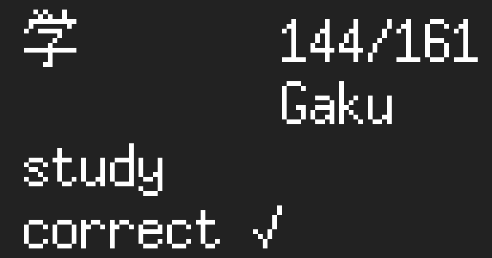

# RemTK
A small test program for the RTK kanji method.



## What is it?
This is a small program written in C that will test you on the kanji characters that are in the Remembering The Kanji book series. 
The program is all based in the terminal and will test you up to the number of kanji that you have learned, so it can be used when you are learning as will as when you have learned them.

## Running

To run the program all you have to do is compile it with GCC and then run it, like so:

```
gcc RemTK.c -o RemTK && ./RemTK
```
But, once you have done this once, all you need to do is:
```
cd _Clone_directory_/
./RemTK
```

## How to use it
When you start the program you will be asked how you want to be tested and this can be done through 4 different options:

### start

#### Normal

In normal testing the program will show you a character and then ask you to type in the keyword / phrase exactly as it is in the 6th edition of the book. An additional feature that I have added to this testing method is the romaji representation of the kanji according to just that character alone in google translate (look into the spell.c program to see how this was done). The user interface for this test looks like this:

```
談       0/0
         Dan

```

Here you can see that you get the kanji, your score (discussed later) as well as the romaji of the character. 

#### Swap 

In swap test mode you will be shown the keyword / phrase and you will have to input the kanji character that is relevant. This may be difficult to do if you don't have japanese input set up on your system or don't know how to type / spell the character. The user interface for this test is the most simple and is as follows:

```
topic    0/0

```

#### Multiple choice 

This test remedies the problems with the Swap test as in this mode you will be shown a keyword / phrase and 3 different kanji that are around the same section in the book. From here you will then just have to type in "1", "2", or "3" to select the answer. The user interface for this testing method is as follows:

```
0/0      canopy 
[姉]    [幌]    [帯]
  1       2       3

```
One difference here is that the score is to the left so that its in the same place no matter the length of the keyword / phrase. 

#### Random 

In random test mode you will be shown a mixture of normal and swap tests as you go through, this means that you will face phrase to kanji and kanji to phrase randomly as you go along. The user interface for this is just a mixture of the two modes. 


After you have selected the type of test that you want, you will then be asked what number you want to test up to. This means that you will input the number of the kanji that you have got up to in the book and you will then be tested on all the prior kanji to that point. So for example, if you have finished chapter 38 then you will see that the number is for the last kanji is 1533 (6th edition) so you would input 1533 and be tested on all the kanji up to that point in the book by your test method. 

### During

During the test you will be asked and then have to answer in the way that you have provided in the test selection at the main menu. However, when you input an answer no matter the mode you will get instant results of how you are doing and if you got it correct. When you give an answer correctly you will be shown:

```
correct ✓ 
```
However, if you get an answer incorrect then you will be shown the correct answer with a tick alongside what you gave as an incorrect answer with a cross like so:

```
溝       0/1
         Mizo
maze
incorrect
'maze'✗
'gutter'✓
```

In addition to this you will also be shown the score counter next to the question that you are being asked, you can see this next to the kanji in the example above. The first number shows you how many you have got correct and the second number shows you how many you have tested, so if you are far into a testing session it would look like this:

```
領       132/147
         Ryō
testing
incorrect
'testing'✗
'jurisdiction'✓

```

### End

When you want to finish the testing and close the program all that you have to do is input nothing into the answer and just press enter. When you do this you will then be presented by an error summary so that you know what ones to go over again, the format for this error summary is as shown:

```
you got 98% corret.
error summary:
1 : 領 : jurisdiction 
2 : 溝 : gutter 
1 : 重 : heavy 
```

The way that this works is that the first number will show you how many times you got that kanji wrong in the test, then is shows you the kanji and finally the keyword / phrase for it. 
